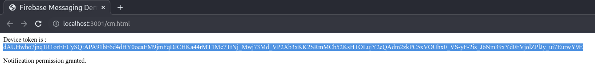
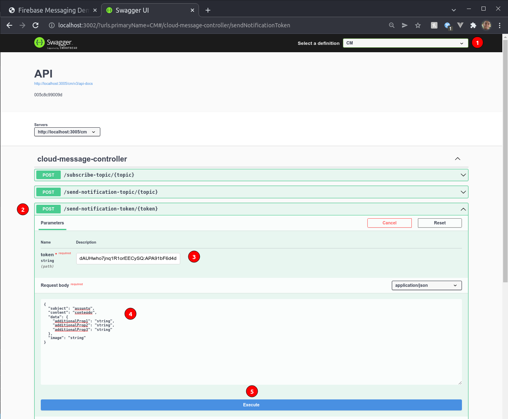
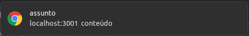

# Push Notification

1. Inicie a stack

```
docker compose up -d
```

2. Permita a execuçao da notificaçao e copie o token gerado em

http://localhost:3001/cm.html



3. Acesse a api CM (Cloud Messaging) e execute o endpoint /send-notification-token com token copiado em

http://localhost:3002/



Resultado


