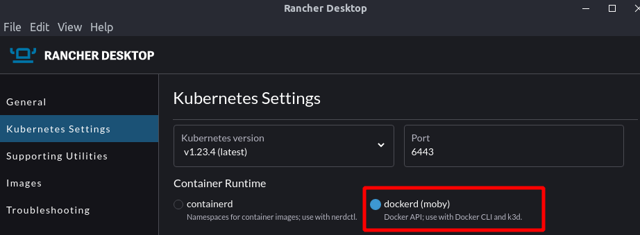

# Kubernetes - Native

Enabling docker over k8s.



now

```
make start
```
and
```
make forward-port
```

Then access 

http://localhost:3001

and 

http://localhost:3002

Scale

```
kubectl scale --replicas=2 deployment/account -n bank
```

Stop

```
make stop
```
