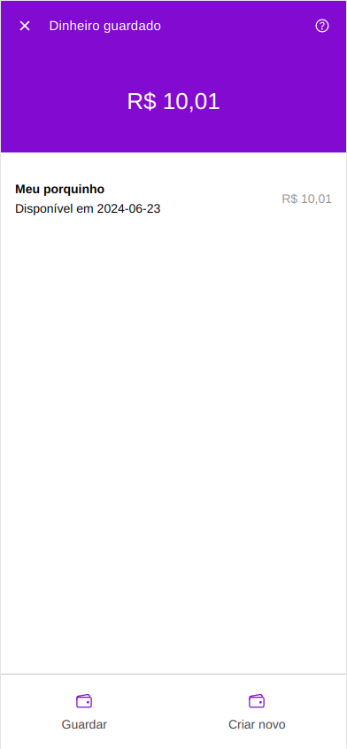
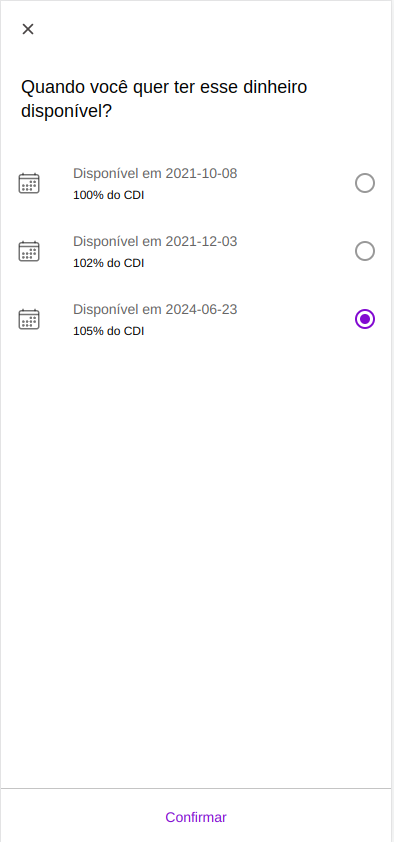
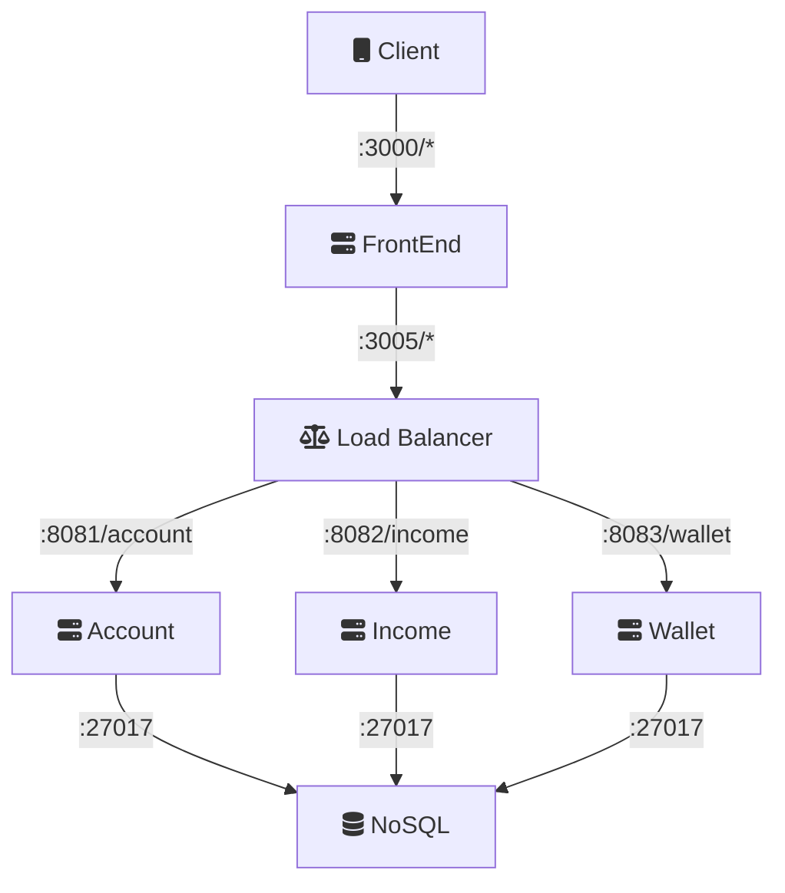

# nubank-stack

Nubank Stack

## Requirements

* [docker](https://docs.docker.com/get-docker)
* [docker-compose](https://docs.docker.com/compose/install)

## Front
* Web - Cliente responsivo 

Wallet/Income





## Infra
* Load Balance - Redirecionador de requisições 
* MongoDB      - Persistência



## Backend
- [x] [Income](app/backend/income)  - Microsserviço responsável pela parte de rendimentos
- [x] [Wallet](app/backend/wallet)   - Microsserviço responsável pela parte de carteiras
- [ ] [Account](app/backend/account)  - Contains methods to access the user account details and the checking account transactions and bills
- [ ] [Auth](app/backend/auth)     - Authentication operations
- [ ] [Card](app/backend/card)     - Contains methods to retrieve the feed of transactions from the credit card
- [ ] [Payment](app/backend/payment)  - Contains methods to create payment requests


## How to run

```
docker-compose up -d
```

Then access 

http://localhost:3000

SwaggerUI

http://localhost:9090

All Services 

| Service      |   Network   |  Port |
|--------------|:-----------:|------:|
| Web          |    Front    |  3000 |
| Load balance |    Front    |  3005 |
| SwaggerUI    |    Front    |  9090 |
| Income       |    Back     |  8081 |
| Wallet       |    Back     |  8082 |
| Account      |    Back     |  8083 |
| MongoDB      | Persistence | 27017 |


Scale 

```
docker-compose up --scale wallet=2 --scale income=2 -d
```

# Kubernetes

```
make start
```
Then access 

http://localhost:3001

and 

http://localhost:3002


Stop

```
make stop
```


# Helm

```
make helm-install
```
Then access

http://localhost:3001

and

http://localhost:3002


### Ref

* [mermaid-editor](https://mermaidjs.github.io/mermaid-live-editor)
* [spring-boot-banner-generator](https://springhow.com/spring-boot-banner-generator/)