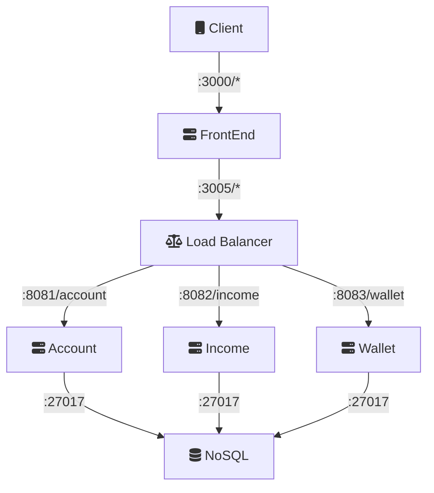

# bank-elastic-stack

Elastic stack using :

1. Docker - Compose
2. Kubernetes - Native
3. Kubernetes - Helm

## Requirements

* [docker](https://docs.docker.com/get-docker)
* [docker-compose](https://docs.docker.com/compose/install)
* [helm](https://rancherdesktop.io/)
* [rancher desktop](https://rancherdesktop.io/)

## Front
* Web - Cliente responsivo 

Wallet/Income

## Infra
* Load Balance - Redirecionador de requisições 
* MongoDB      - Persistência

All Services 

| Service      | Network |  Port |
|--------------|:-------:|------:|
| Web          |  Front  |  3001 |
| SwaggerUI    |  Front  |  3002 |
| Load balance |  Front  |  3005 |
| Income       |  Back   |  3005 |
| Wallet       |  Back   |  3005 |
| Account      |  Back   |  3005 |
| MongoDB      |  Back   | 27017 |

## Backend
- [x] [Income](app/backend/income)  - Microsserviço responsável pela parte de rendimentos
- [x] [Wallet](app/backend/wallet)   - Microsserviço responsável pela parte de carteiras
- [ ] [Account](app/backend/account)  - Contains methods to access the user account details and the checking account transactions and bills
- [ ] [Auth](app/backend/auth)     - Authentication operations
- [ ] [Card](app/backend/card)     - Contains methods to retrieve the feed of transactions from the credit card
- [ ] [Payment](app/backend/payment)  - Contains methods to create payment requests

## How to run

1. [Compose](COMPOSE.md)
2. [K8S](K8S.md)
3. [Helm](HELM.md)

### Ref

* [mermaid-editor](https://mermaidjs.github.io/mermaid-live-editor)
* [spring-boot-banner-generator](https://springhow.com/spring-boot-banner-generator/)
* [kompose](https://kompose.io/)